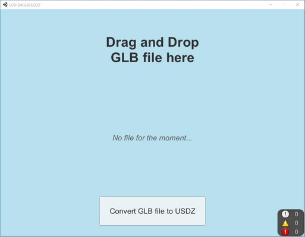

# UGLB2USDZ
Unity GUI frontend for usdzconvert_windows. Support drag and drop.

## How to start
There is a relative shortcut to the exe of the app. When doubled clicked, the .exe is started.

## How to use
Drag an drop a GLB file on the GUI. After that you can click on the "Convert the GLB file to USDZ".
The converted USDZ file is saved next to the shortcut of the app.
The relative shortcut has been created with [Relative](http://www.csparks.com/Relative/index.html)

## Requirements
### usdz_convert
The minimal release of **usdz_convert** for windows must be downloaded, unzipped, and placed next to the .exe build of the app.

### meshoptimizer/gltfpack
gltfpack is used to compress/pack the GLB before converting to usdz [Mesh-optimizer](https://github.com/zeux/meshoptimizer)